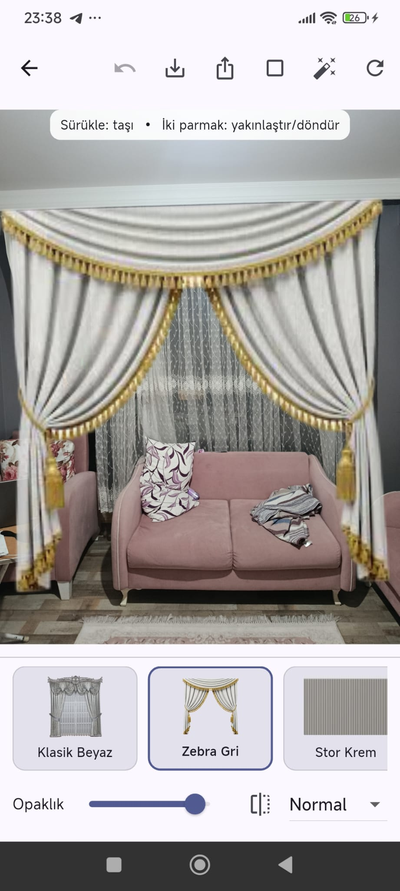

# Perdevizyon – Flutter ile Otomatik Perde Yerleştirme (AR)

Flutter uygulaması: Fotoğrafındaki pencereyi otomatik algılar, seçtiğin perde modelini perspektif ile yerleştirir ve öndeki nesneleri (koltuk, masa, TV, bitki, insan vb.) otomatik olarak perdenin önünde bırakır (occlusion).

Repo: [Erayy394/perdevizyon](https://github.com/Erayy394/perdevizyon)



## Özellikler
- Otomatik pencere tespiti (segmentation maskesinden sağlam dörtgen/quad)
- Gerçekçi homography (perspektif) warp ile perde yerleştirme
- Otomatik önplan örtüşme (occlusion): koltuk/masa/TV/insan/bitki önde kalır
- Manuel mod: modeli sürükle–yakınlaştır–döndür; opaklık ve karışım modu
- Galeriden yükle veya kamerayla çek
- Performans: Büyük görüntülerde Isolate ile warp ve downscale
- Kenar yumuşatma (feather) ve yumuşak gölge (soft shadow)

## Gereksinimler
- Flutter SDK (3.x önerilir)
- Android/iOS geliştirme ortamı
- Cihazda kamera izni (kamera modunda)

## Kurulum
```bash
flutter pub get
```

Gerekirse platform klasörleri için:
```bash
flutter create .
```

## Çalıştırma
```bash
flutter run --release
```

Bağlı cihazı seçmek için `-d <deviceId>` kullanabilirsiniz.

## Kullanım
1) Uygulamayı açın, Kameradan çekin ya da Galeriden fotoğraf seçin
2) Model karuselinden perde PNG modelini seçin
3) Otomatik Yerleştirme: Tek dokunuşla pencere quad’ı çıkarılır ve perde yerleşir
4) Örtüşme (Occlusion): Ön plandaki nesneler otomatik olarak perdenin önünde kalır
5) Gerekirse köşeleri sürükleyerek quad’ı iyileştirin; ardından Kaydet/Paylaş

## Teknik Mimari (Kısaca)
- `lib/src/ml/seg_model.dart`: YOLOv8-seg TFLite arayüzü (sınıf skorları + maske proto)
- `lib/src/ml/depth_model.dart`: Derinlik tahmini (monocular) arayüzü
- `lib/src/ml/preprocess.dart`: Görselleri CHW Float32’ye hazırlama (letterbox/resize)
- `lib/src/vision/postprocess.dart`: NMS, IoU, maskeden quad çıkarma vb.
- `lib/src/vision/occlusion.dart`: Segmentasyon + derinliğe göre occluder maskesi üretimi
- `lib/src/image_composer.dart`: Homography warp + feather + shadow + blend/occlusion
- `lib/src/auto/auto_place.dart`: Tüm otomatik akışın orkestrasyonu

## İzinler
- Kamera: `permission_handler` ile istenir
- Depolama/Yazma: Kaydet/Paylaş için gerekebilir (Android sürümüne göre değişir)

## Sorun Giderme
- Impeller/External Texture uyarıları (Vulkan): Bazı cihazlarda kamera/texture plugin’leri uyarı verebilir. Sorun yaşarsanız geçici olarak debug’da çalıştırın veya ilgili plugin sürümlerini güncelleyin.
- Model sınıf isimleri: `lib/src/ml/classes.dart` içindeki `names` dizisini kendi YOLOv8-seg modelinizin sınıf sırasına göre güncelleyin (özellikle `window` ve occluder sınıfları).
- Performans düşükse: `auto_place.dart` içinde downscale boyutlarını ve `depthMargin / dilate / blur` ayarlarını artırıp-azaltarak dengeleyin.

## Lisans
MIT
